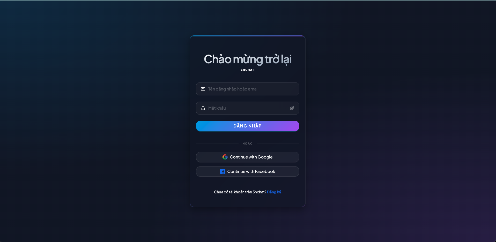
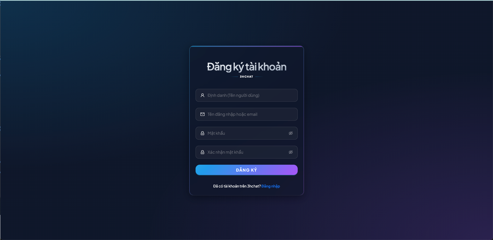
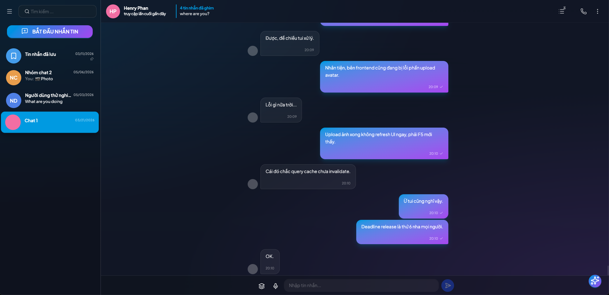
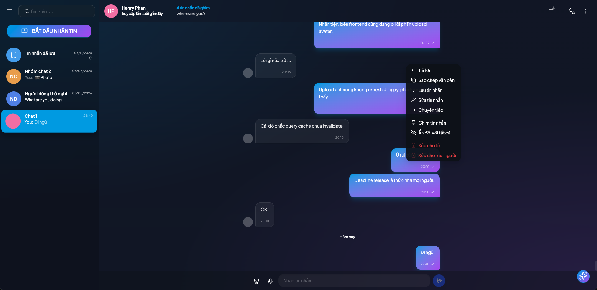
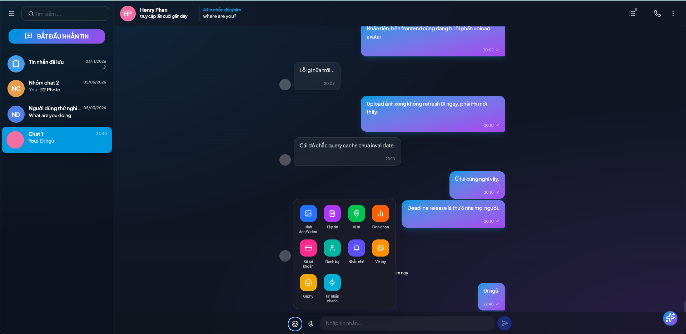
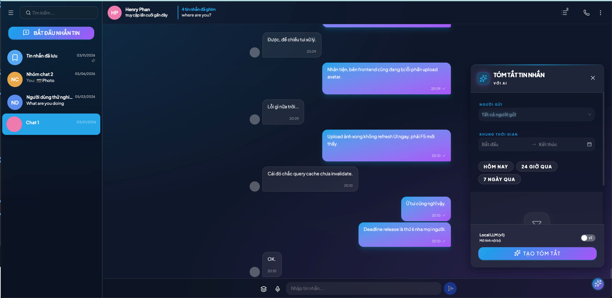

# 3HChat — Frontend

A React 19 single-page application for a Telegram-like real-time messaging and calling experience. It integrates WebRTC audio/video calls, MQTT-based presence, Firebase push notifications, and a rich chat UI — all wired together with Zustand state management and a carefully layered set of custom hooks.








---

## Tech Stack

| Technology | Why it was chosen |
|---|---|
| **React 19** | Latest concurrent features; hooks-first architecture aligns with the real-time state model |
| **Vite 7** | Sub-second HMR during development; tree-shaking keeps the production bundle lean |
| **TypeScript 5** | Catches socket event shape mismatches and API response types at compile time |
| **Tailwind CSS 4** | Utility-first styling; no context switching between CSS files and component logic |
| **Radix UI** | Accessible, unstyled primitives (Dialog, Popover, DropdownMenu) — style via Tailwind |
| **Ant Design 6** | Battle-tested complex components (Upload, Table, Form) where Radix would be overkill |
| **Zustand 5** | Minimal boilerplate for global state; stores map 1:1 to real-time domains (auth, chat, presence) |
| **React Router 7** | File-system-friendly routing with nested layouts for chat panels |
| **Socket.IO client 4** | Pairs with the backend's Socket.IO server for bidirectional chat events |
| **MQTT client 5** | WebSocket-based pub/sub for lightweight presence and typing indicators |
| **Firebase 12** | Firebase Cloud Messaging service worker for background push notifications |
| **Framer Motion 12** | Smooth animated transitions for call overlays and message list entries |
| **i18next 26** | Multi-language support with React bindings and lazy-loaded translation files |
| **React Hook Form 7** | Performant form handling with minimal re-renders for login/register flows |
| **Axios 1** | HTTP client with interceptors for JWT refresh and unified error handling |
| **Recharts 2** | Analytics charts for call duration and usage stats |

---

## Key Features

- **Real-time chat** — one-to-one and group conversations, message seen receipts, typing indicators
- **Rich message interactions** — emoji reactions, pin, edit with history, soft-delete, reply, forward
- **Media sharing** — image, video, audio, and file attachments with preview
- **Full-text message search** across conversations
- **AI message summarization** — one-click summary via backend endpoint
- **WebRTC audio/video calls** — peer-to-peer media with an animated incoming call overlay
- **Call controls** — mute/unmute, camera toggle, screen share, end call
- **MQTT presence** — live online/offline status and typing bubbles
- **Firebase push notifications** — foreground and background FCM messages via service worker
- **Google & Facebook OAuth** — social login with redirect flow
- **Internationalization** — i18next with language switcher
- **Responsive design** — dark-themed UI optimized for desktop and mobile

---

## Installation & Setup

### Prerequisites

- Node.js 20+
- Running instances of `Telegram-mini` (API) and `CallWebRTC` (signaling)
- MQTT broker accessible over WebSocket (e.g. Mosquitto on port 9001)
- Firebase project with Cloud Messaging enabled

### Steps

```bash
# 1. Enter the directory
cd Telegram-miniTe-FE

# 2. Install dependencies
npm install

# 3. Configure environment
cp .env.example .env
# Edit .env with your service URLs and Firebase config
```

### Key environment variables

```env
VITE_API_BASE_URL=http://localhost:3000
VITE_MQTT_URL=ws://localhost:9001
VITE_RTC_SERVICE_URL=http://localhost:4000

VITE_FIREBASE_API_KEY=...
VITE_FIREBASE_AUTH_DOMAIN=...
VITE_FIREBASE_PROJECT_ID=...
VITE_FIREBASE_MESSAGING_SENDER_ID=...
VITE_FIREBASE_APP_ID=...
```

```bash
# 4. Start development server
npm run dev
# App runs on http://localhost:5173

# 5. Build for production
npm run build

# 6. Preview production build
npm run preview
```

### Deploy to Vercel

A `vercel.json` is included. Push to your connected repo or run:

```bash
npx vercel --prod
```

---

## Project Structure

```
src/
├── components/      # UI components (ChatPanel, VideoCall, IncomingCallOverlay, ...)
├── hooks/           # Custom hooks (useWebRTC, useAuth, useMessageSummary, ...)
├── store/           # Zustand stores (auth.store, chat.store, presence.store)
├── services/        # Axios API clients and service classes
├── contexts/        # React Context (WebRTCContext for global call state)
├── mqtt/            # MQTT client setup and event listeners
├── firebase/        # FCM initialization and service worker registration
├── types/           # Shared TypeScript types (chat, webrtc, error)
└── pages/           # Route-level components
```

---

## What I Learned

1. **Encapsulating the full WebRTC peer connection lifecycle in a single `useWebRTC` hook** — offer/answer exchange, ICE trickle, media track management, call teardown — was the right call. Components stay declarative; all the stateful WebRTC complexity lives in one auditable place.

2. **Combining two real-time clients (Socket.IO + MQTT) on the frontend** requires discipline. Socket.IO handles targeted bidirectional events (chat messages, seen); MQTT handles broadcast presence topics. Keeping them separate in `/mqtt/` and using Socket.IO only through `services/` prevented the two from bleeding into each other.

3. **Zustand stores map cleanly to real-time domains**: `auth.store` owns the current user, `chat.store` owns conversations and messages, `presence.store` owns online status. This made it easy to subscribe to just the slice of state a component actually needs, avoiding re-render cascades.

4. **Radix UI + Tailwind** is a genuinely productive combination — accessible keyboard navigation and ARIA roles for free, with full visual control through utility classes. The only trade-off is verbose className strings, which Tailwind Merge keeps manageable.

5. **Firebase Cloud Messaging in a Vite app** requires a service worker (`firebase-messaging-sw.js`) at the public root, outside the module graph. Getting the Firebase config into the service worker without exposing secrets in source control required careful use of Vite's `import.meta.env` at build time.
